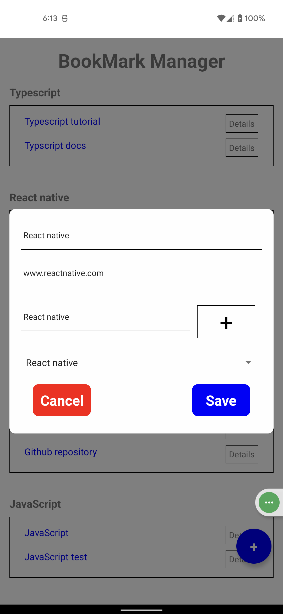
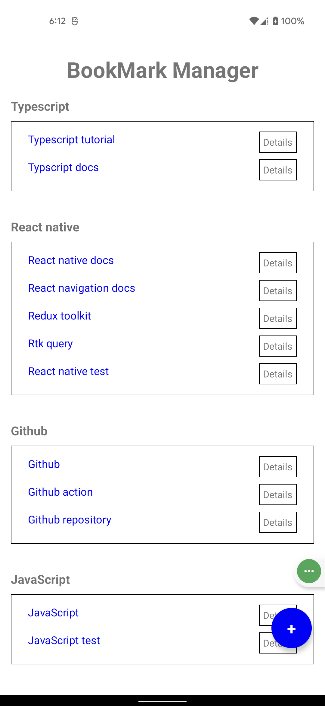
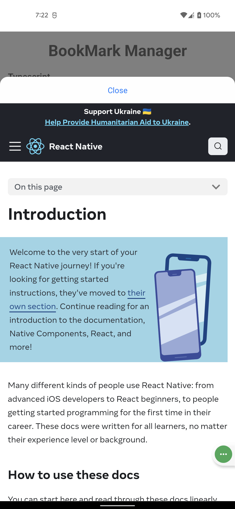

# BookmarkManager
##### It's a cross platform react native bookmark manager app to manage your bookmarks
##### I have completed it as part of the recruitment process of React native developer at Selise 
##### App UI Screens
 &emsp; &emsp;  &emsp; &emsp;  

 
### Tools & libraries used in this project: 
- Typescript
- React native 
- Redux toolkit
- Redux persist
- Async storage

### Insturction to build & run: 
- npm install / yarn install 
- npx react-native run-android

